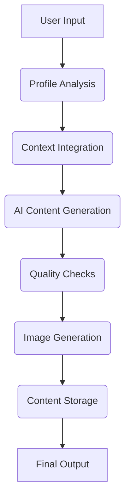

# Content Hub - When AI Meets your Voice

Content Hub is an innovative platform that leverages IBM's Granite AI models to transform social media engagement through personalized, SEO-optimized content generation. The platform supports multiple social media platforms including Twitter, LinkedIn, and Instagram.

## 🚀 Features

- **Multi-Platform Support**: Generate content for Twitter, LinkedIn, and Instagram
- **Advanced AI Analysis**: Powered by IBM Granite 3-8B Instruct model
- **Real-time Processing**: Dynamic content generation within seconds
- **SEO Optimization**: Built-in optimization for better content visibility
- **Image Generation**: AI-powered image generation for social media posts
- **Analytics Integration**: Detailed content performance metrics
- **Secure Authentication**: IBM API token management with automatic renewal
- **Content Storage**: Supabase integration for persistent storage

## 🔧 Technical Architecture

### IBM API Token Management

The application handles IBM API authentication through a secure token management system:

```typescript
// API route for token generation
export async function POST() {
  const apiKey = process.env.IBM_API_KEY;
  if (!apiKey) {
    return NextResponse.json(
      { error: "IBM_API_KEY is not defined" },
      { status: 500 }
    );
  }

  try {
    const tokenResponse = await fetch("https://iam.cloud.ibm.com/identity/token", {
      method: "POST",
      headers: { "Content-Type": "application/x-www-form-urlencoded" },
      body: `grant_type=urn:ibm:params:oauth:grant-type:apikey&apikey=${apiKey}`,
    });

    const tokenData = await tokenResponse.json();
    return NextResponse.json(tokenData, { status: 200 });
  } catch (error) {
    return NextResponse.json(
      { error: error instanceof Error ? error.message : "Unknown error" },
      { status: 500 }
    );
  }
}
```

This token service ensures secure communication by:
- Validating the IBM API key
- Obtaining and refreshing access tokens
- Handling error states and rate limits
- Using server-side authentication for API calls

### IBM Granite AI Integration

We utilize IBM's Granite-3-8B-Instruct model for various content generation tasks:

```typescript
const callIBMProfileAnalysis = async (ibmInput: string): Promise<string> => {
  const ibmApiResponse = await fetch("/api/ibm-profile-analysis", {
    method: "POST",
    headers: { "Content-Type": "application/json" },
    body: JSON.stringify({
      input: ibmInput,
      parameters: {
        decoding_method: "greedy",
        max_new_tokens: 8000,
        min_new_tokens: 0,
        stop_sequences: [],
        repetition_penalty: 1,
      },
      model_id: "ibm/granite-3-8b-instruct",
      project_id: "b44a8ace-b7f0-49d7-b212-da6ce8d60825",
    }),
  });
}
```

## 📦 Installation

1. Clone the repository
```bash
git clone https://github.com/yourusername/content-hub.git
cd content-hub
```

2. Install dependencies:
```bash
npm install
```

3. Set up environment variables:
```bash
IBM_API_KEY=your_ibm_api_key_here
NEXT_PUBLIC_SUPABASE_URL=your_supabase_url
NEXT_PUBLIC_SUPABASE_ANON_KEY=your_supabase_anon_key
```

## 🔑 IBM API Setup

1. Create an IBM Cloud account at [IBM Cloud](https://cloud.ibm.com)
2. Generate an API key from IBM Cloud IAM:
   - Navigate to Manage > Access (IAM)
   - Select API Keys > Create New API Key
3. Configure model parameters:
   - **Model**: ibm/granite-3-8b-instruct
   - **Max Tokens**: 8000 (analysis), 200 (tweets)
   - **Decoding Method**: Greedy
   - **Repetition Penalty**: 1.0

## 🌟 Content Generation Flow

### 1. Profile Analysis Phase

The system begins with comprehensive profile analysis:

```typescript
const profileAnalysisPrompt = `
System Prompt:
Analyze JSON-formatted data representing a user's profile from Twitter or LinkedIn,
focusing on understanding and describing how the user writes and expresses themselves.

Key Analysis Aspects:
- Tone and Voice (formal/casual/humorous)
- Language patterns and word choice
- Content originality and creativity
- Platform-specific style differences
- Recurring themes and topics
`;
```

### 2. Content Generation Process

#### Single Tweet Generation:
```typescript
const tweetPrompt = `
System Prompt:
Generate a single tweet (280 characters max) that:
1. Mirrors the user's unique voice from profile analysis
2. Incorporates query context organically
3. Uses appropriate hashtags and emojis
4. Maintains platform-specific conventions

Example Output Format:
"Just launched our new AI-powered content generator! 🚀 Perfect for social media managers looking to boost engagement. #DigitalMarketing #AI"
`;
```

#### Thread Generation:
```typescript
const threadPrompt = `
System Prompt:
Create 7 connected tweets about ${topic} that:
1. Start with "#@" and end with "@#"
2. Maintain narrative flow between tweets
3. Vary tweet structures (questions, stats, quotes)
4. Include relevant hashtags every 2-3 tweets

Example Format:
#@ Excited to share our latest research on AI content generation! @#
#@ Key finding 1: AI-generated posts see 42% higher engagement... @#
`;
```

#### LinkedIn Post Generation:
```typescript
const linkedinPrompt = `
System Prompt:
Generate professional LinkedIn post that:
1. Uses industry-specific terminology
2. Maintains formal yet engaging tone
3. Includes call-to-action
4. Optimized for LinkedIn algorithm

Example Format:
"We're thrilled to announce our Series B funding round of $25M... [Article link]"
`;
```

### 3. Content Enhancement

**Image Generation:**
```typescript
const generateImage = async (text: string) => {
  const response = await fetch("https://api.image-service.com/v1/generate", {
    method: "POST",
    headers: { "Content-Type": "application/json" },
    body: JSON.stringify({ text: text }),
  });
  return response.json().imageUrl;
}
```

**Content Storage:**
```typescript
const savePost = async (content: string, imageUrl: string) => {
  await supabase.from("social_media_posts").insert([
    {
      platform: "twitter",
      content: content,
      img_url: imageUrl,
      created_at: new Date().toISOString()
    }
  ]);
}
```

## 💡 Usage Examples

### Profile Analysis Workflow:
1. User uploads social media data
2. System validates JSON structure
3. AI analyzes writing style and tone
4. Generates comprehensive style report
5. Stores analysis for future use

### Tweet Generation Process:


## 🛠 Quality Assurance

The system implements multiple quality checks:
1. Content length validation
2. Platform-specific formatting
3. Tone consistency analysis
4. SEO keyword integration
5. Automated profanity filtering

```typescript
function validateTweet(tweet: string): boolean {
  return tweet.length <= 280 &&
         !containsProfanity(tweet) &&
         hasHashtag(tweet);
}
```
## 🙏 Acknowledgments

- Powered by [IBM Granite](https://www.ibm.com)
- Built with support from [Lablab.ai](https://lablab.ai)
- AGENTS by [AGENT.AI ](https://agent.ai)
- Database powered by [Supabase](https://supabase.io)

